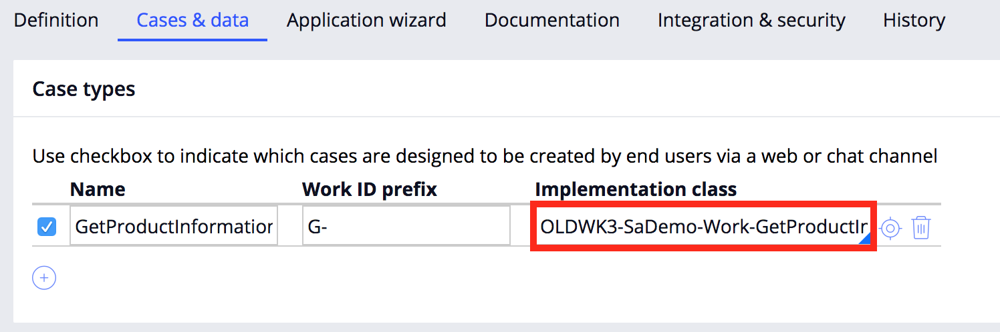
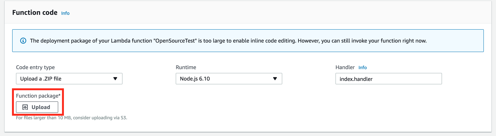
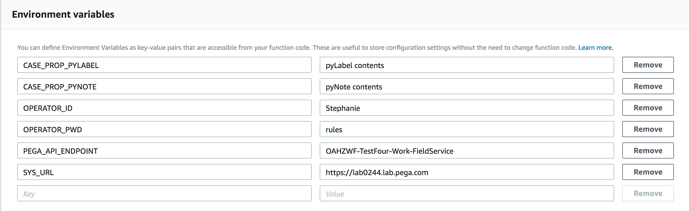
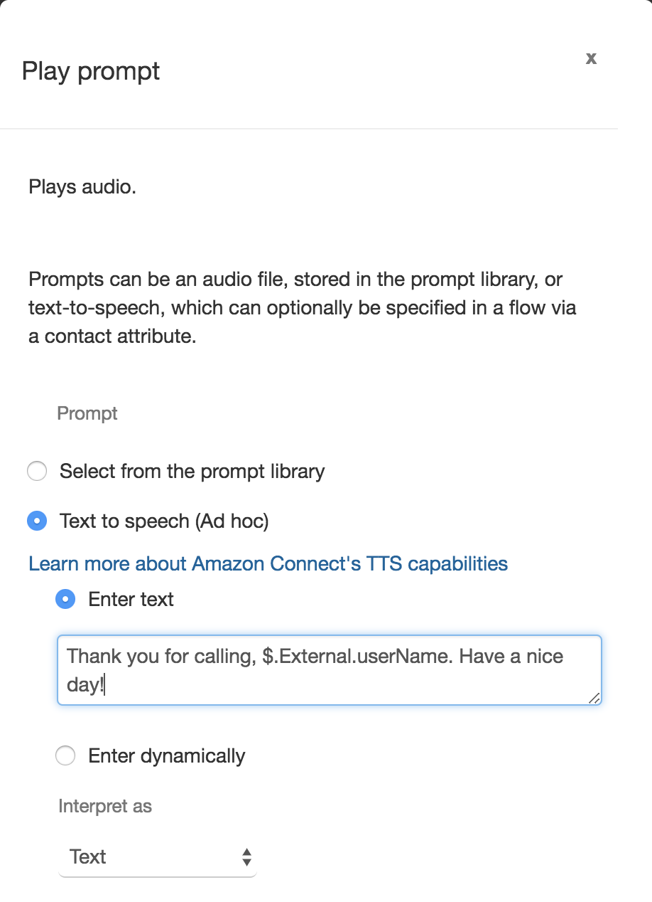
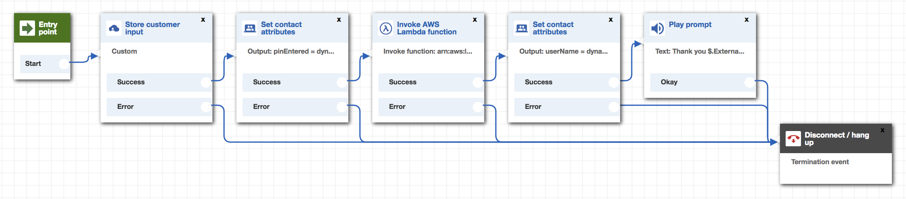
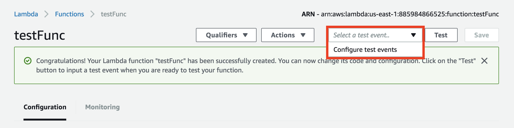

# Pega API Lambda Boilerplate for integrating with Amazon Connect

This boilerplate Lambda function is designed to be triggered from an Amazon Connect contact flow. It demonstrates sending data from Amazon Connect (a user-entered PIN number and the caller's phone number) to Pega via the "Create Case" API. It also returns a variable to Amazon Connect. 

For more information, you can access the Pega API help documentation from within **Designer Studio > Resources menu**.

## Prerequisites

- An externally exposed Pega instance (not a trial)
- Amazon developer account

## Set up your case in Pega

In your Pega account: 

- Start by [creating a case in your Pega application](https://pdn.pega.com/creating-case "Creating a Case in Pega").

- Copy down the class name of your new case type. You can find this by navigating to **Application Menu > Definition**. Then click the **Cases and data** tab and copy the class from the implementation class:



## Set up the Lambda function

In AWS Lambda: 

- Create a new function from scratch, select Node 6.1 as your runtime enviroment, and [choose a role with the permissions you need](https://docs.aws.amazon.com/IAM/latest/UserGuide/id_roles_create_for-service.html?icmpid=docs_iam_console). For additional information on setting up your Lambda function, see [here](https://docs.aws.amazon.com/lambda/latest/dg/get-started-create-function.html).

- Assign a [resource policy](https://docs.aws.amazon.com/connect/latest/adminguide/connect-lambda-functions.html) to grant the permissions for Amazon Connect to be able to access this function.

- Once you've created your function, upload the archive.zip found in this repository under **Function package**: 



- Set your enviroment variables 

**CASE_PROP_PYLABEL** - This will set the pyLabel property of your case

**CASE_PROP_PYNOTE** - This will set the pyNote property of your case

**OPERATOR_ID** - The operator ID to authenticate the API call

**OPERATOR_PWD** - The operators password

**PEGA_API_ENDPOINT** - Enter the case class that you copied earlier

**SYS_URL** - The url of your Pega instance

When you're done, your environment variables should look like the following: 



If you'd like, you can encrypt your enviroment variables by following the [documentation on Amazon](https://docs.aws.amazon.com/lambda/latest/dg/env_variables.html#env_encrypt "Encrypting Variables").

## Set up your Amazon Connect contact flow

In Amazon Connect:

- Claim a phone number. 

- In **Routing > Contact Flows**, create and save a new contact flow.

- In **Routing > Phone Numbers**, choose the phone number you've claimed. Connect your number to your new flow by choosing your contact flow under **Contact Flow / IVR**.

- Now return to **Routing > Contact Flows** to start building out your flow. To prompt the caller to enter a number, connect the entry point of your contact flow to a **Store Customer Input** block. 


- Save the user input by adding a **Set contact attributes** block. Choose **Use attribute** and set **Type: System**, **Destination key: pinEntered**, and **Source Attribute: Stored customer input**.


- Now add a **Invoke AWS Lambda function** block. Add the Function ARN of your new Lambda function. Under **Function input parameters**, choose **Send attribute**. Set **Type: System**, **Key: pinEntered**, and **Attribute: Stored customer input**.


- Now add a **Set contact attributes** block. Choose **Use attribute** and set **Type: External**, **Destination key: userName**, and **Source Attribute: userName**.


- Now you can use the variable you passed from Pega ("userName") in your contact flow. For example, the system can read out the variable to the caller: add a **Play Prompt** block to your contact flow, choose the **Text to speech** option, and use the syntax **$.External.userName**. 



- Finish the flow by connecting your last block to the Disconnect block. (Be sure to add error paths to your flow as well; for testing, you can connect these to the Disconnect block or add new blocks for error messaging.) When you're done, your flow should look something like this: 



## Testing

Finally, to confirm that you've configured your function properly, you'll want to run a test. In your Lambda function editor, go to **_Select a test event..._ > Configure test events > Create new test event**:



Create a new event template based on the Amazon Connect event that triggers your Lambda. It may be helpful to add a console.log to your lambda function to log the event, trigger the function with Amazon Connect, then review the AWS Lambda logs in **Monitoring > View logs in Cloudwatch**. Copy the JSON structure of an event sent from Amazon Connect and use this to create your test event. 

It should looks something like the following: 

```{ 
  "Details": { 
    "ContactData": { 
      "Attributes": { "pinEntered": "1234" },
      "Channel": "VOICE",
      "ContactId": "XXXXXXXX-XXXX-XXXX-XXXX-XXXXXXXXXXXX",
      "CustomerEndpoint": { "Address": "+19999999999", "Type": "TELEPHONE_NUMBER" },
      "InitialContactId": "XXXXXXXX-XXXX-XXXX-XXXX-XXXXXXXXXXXX",
      "InitiationMethod": "INBOUND",
      "InstanceARN": "arn:aws:connect:us-east-1:XXXXXXXXXXXX:instance/XXXXXXXX-XXXX-XXXX-XXXX-XXXXXXXXXXXX",
      "PreviousContactId": "XXXXXXXX-XXXX-XXXX-XXXX-XXXXXXXXXXXX",
      "Queue": null,
      "SystemEndpoint": { "Address": "+19999999999", "Type": "TELEPHONE_NUMBER" } 
    },
    "Parameters": { 
      "pinEntered": "1234" 
    } 
  },
  "Name": "ContactFlowEvent" 
}
```

Once you've added and saved your new test, you can click **Test** in your Lambda to trigger a test.
